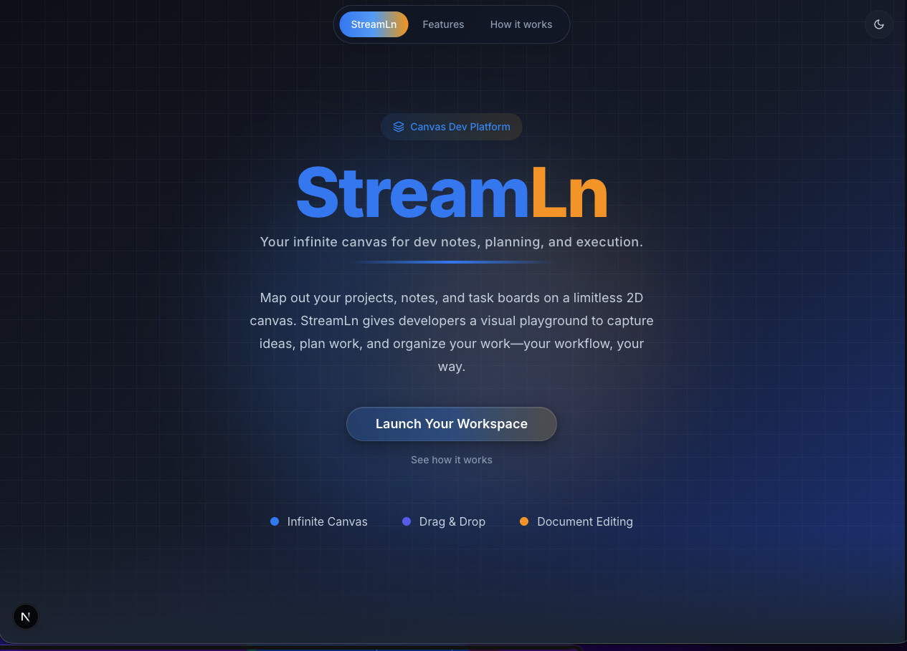
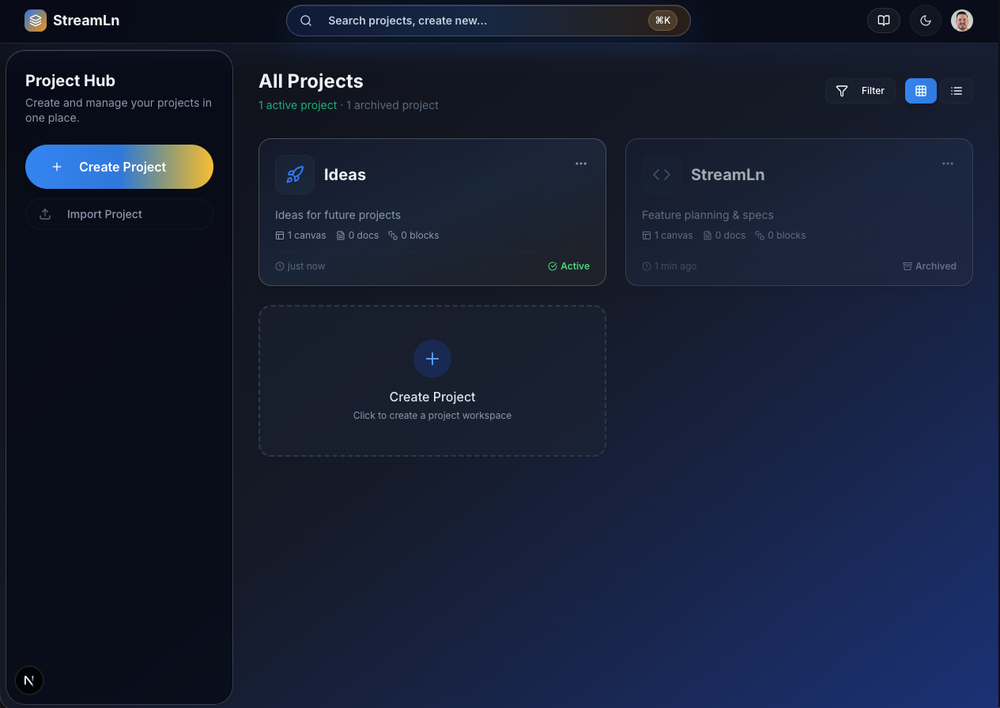
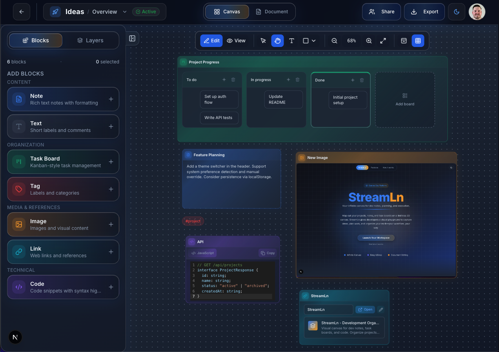
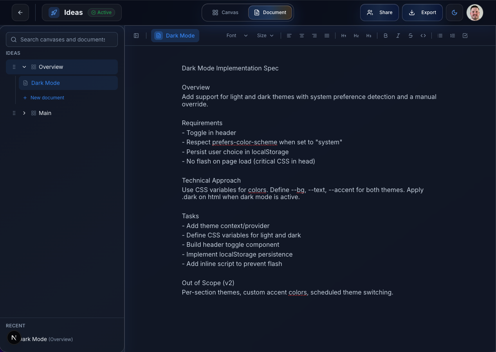
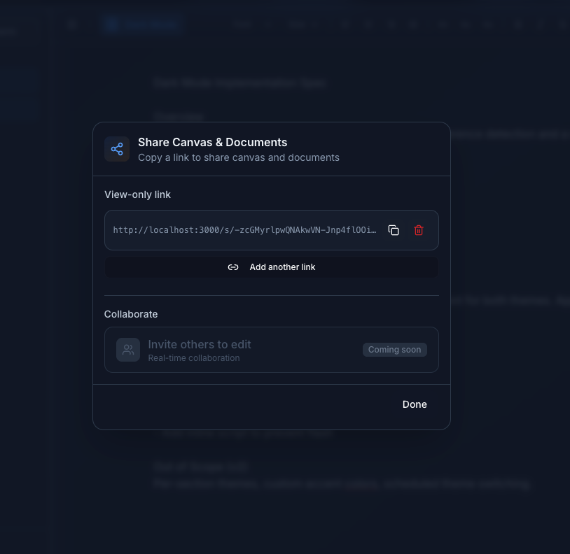
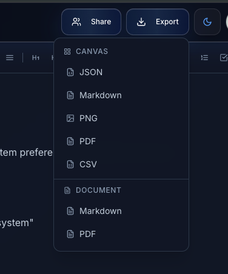
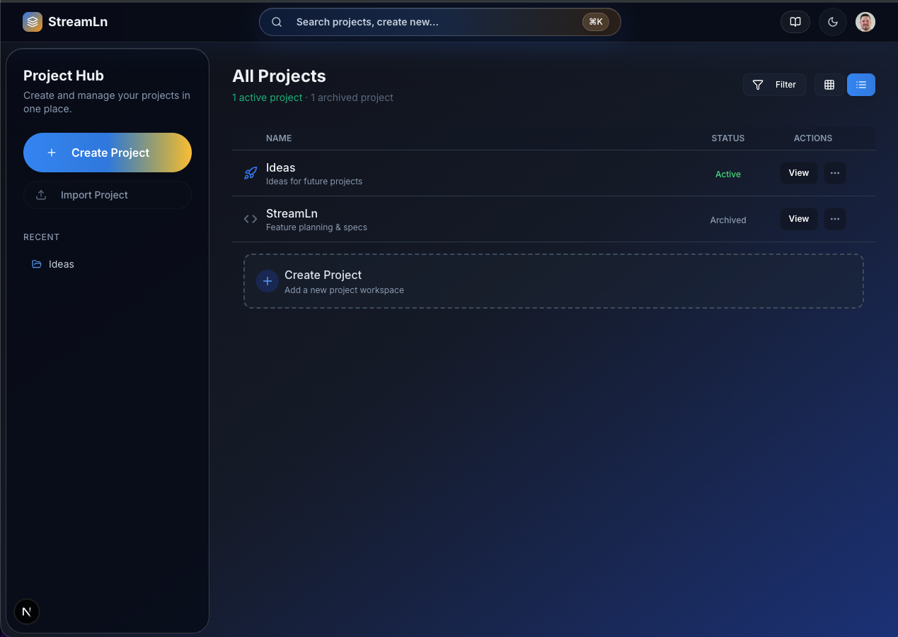
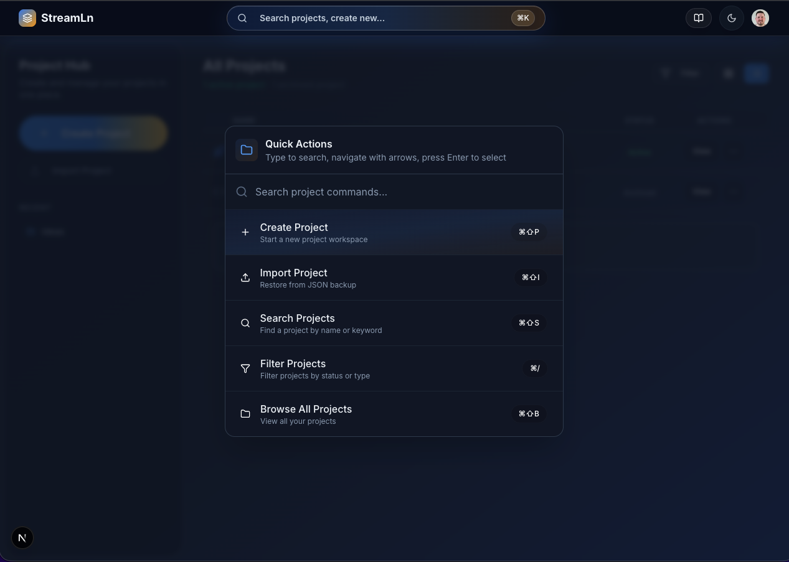

<div align="center">

# **StreamLn**

**Development organization made simple.**

*Your infinite canvas for dev notes, planning, and execution.*

[](https://nextjs.org/)
[](https://react.dev/)
[](https://prisma.io/)
[](https://www.typescriptlang.org/)

</div>

---

## About

StreamLn combines smart technical notes, visual task boards, and document editing into one interface. Built for users who need structure and clarity—map out your projects, notes, and task boards on a limitless 2D canvas. Your workflow, your way.

### Key Features

| Feature | Description |
|---------|-------------|
| **Infinite Canvas** | Unlimited 2D workspace—place, move, and organize content anywhere. Zoom from overview to detail seamlessly. |
| **Document Editor** | Full-screen rich text documents with headings, task lists, and formatting. Export to Markdown or PDF. |
| **Drag & Drop** | Move notes, tasks, and content blocks freely. Resize and arrange with intuitive gestures. |
| **Visual Task Boards** | Kanban-style boards directly on your canvas. Drag tasks between columns. |
| **Command Palette** | `⌘K` to create projects, search by name, filter by status, or browse all. |
| **Export & Backup** | Export projects as JSON, Markdown, or PDF. Import from backup to restore. |
| **Presentation Mode** | Share your canvas without editing UI. Focus on your work or walk through plans. |

### Screenshots










---

## Tech Stack

- **Framework:** Next.js 15, React 19
- **Database:** PostgreSQL + Prisma
- **Auth:** Clerk
- **Editor:** Tiptap (rich text), CodeMirror (code blocks)
- **Styling:** Tailwind CSS, Framer Motion
- **Storage:** Vercel Blob (file uploads)

---

## Prerequisites

- Node.js 18+
- PostgreSQL
- [Clerk](https://clerk.com) account (for auth)
- [Vercel](https://vercel.com) account (optional, for Blob storage)

---

## Quick Start

```bash
# Clone and install
git clone https://github.com/jvpatey/StreamLn.git
cd StreamLn
npm install

# Set up environment variables (see Environment Variables below)
# Create a .env file with the required variables

# Initialize database
npx prisma generate
npx prisma db push

# Run development server
npm run dev
```

Open [http://localhost:3000](http://localhost:3000) to view the app.

---

## Environment Variables

Create a `.env` file in the project root:

| Variable | Description |
|----------|-------------|
| `DATABASE_URL` | PostgreSQL connection string |
| `NEXT_PUBLIC_CLERK_PUBLISHABLE_KEY` | Clerk publishable key |
| `CLERK_SECRET_KEY` | Clerk secret key |
| `NEXT_PUBLIC_APP_URL` | App URL (e.g. `http://localhost:3000`) |
| `BLOB_READ_WRITE_TOKEN` | Vercel Blob token (for file uploads) |

---

## Scripts

| Command | Description |
|---------|-------------|
| `npm run dev` | Start development server |
| `npm run build` | Run tests, generate Prisma client, build for production |
| `npm run start` | Start production server |
| `npm run lint` | Run ESLint |
| `npm run test` | Run Vitest tests |
| `npm run test:watch` | Run tests in watch mode |

---

## Project Structure

```
StreamLn/
├── app/                    # Next.js app router (pages, API routes, layout)
├── components/             # React components
│   ├── sections/home/      # Landing page sections
│   └── ui/                 # Shared UI, projects, canvas
├── lib/                    # Utilities, API clients, validations
├── prisma/                 # Schema and migrations
└── tests/                  # API and integration tests
```

---

## License

Private project.
